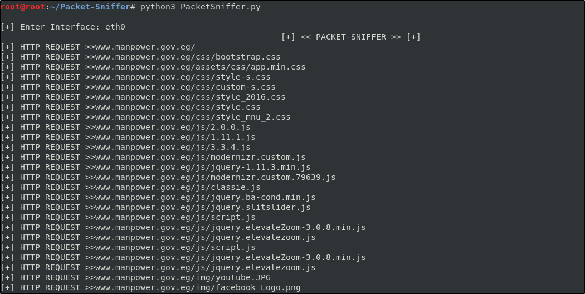

# Packet-Sniffer
- A Tool Written IN Python3 That Sniff Data From The Interface You Select
# Download And Run This Tool
- git clone https://github.com/DEMON1A/Packet-Sniffer
- cd Packet-Sniffer
- python3 PacketSniffer.py
# Usage
- You Can Use This Tool To Run MITM With Any ARP Spoof Tool! 
- Go to Packet-Sniffer And Select The Interface You Want To Sniff Data From
# View

